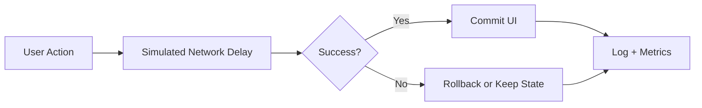

# UX Latency Lab

Interactive lab for testing how latency and feedback patterns influence user perception.

## Experiments Included

1. **Interaction delay threshold**
   - Configure artificial delay.
   - Apply network profile presets.
   - Run repeated trials.
- Benchmark all built-in profiles in one shot.
- Delay trials can be exported as CSV for spreadsheet review or product review docs.
- View measured timings and average.
- Session percentile cut points for median, P75, P95, and slowest-trial analysis.
- Profile benchmark summary calls out the fastest profile, harshest latency band, and the feedback-design takeaway.
- Latency budget board maps the current trial distribution to instant, responsive, and loader-worthy product thresholds.

2. **Loading feedback perception**
   - Compare spinner vs skeleton loading states.
   - Record perceived speed ratings.
   - Track average scores by loading strategy.

3. **Optimistic UI vs standard updates**
   - Adjustable simulated failure rate.
   - Standard flow waits for server before UI update.
   - Optimistic flow updates immediately and rolls back on failure.
   - Event log records behavior over time.
   - Success/rollback rate summary explains when optimistic UI is still justified.
- Session memo converts the current experiment data into a product-facing recommendation.
- Policy scorecard turns the current session into concrete guidance for action feedback, loader choice, and commit strategy.
- Release-readiness board condenses all three experiments into a single ship/no-ship style brief.
- Latency posture board turns the full session into a compact operating read on tail risk, loader posture, and rollback pressure.
- Intervention ladder turns the current evidence into a concrete acknowledge-vs-loader-vs-optimistic policy recommendation.
- Failure-rate sweep now ends with a policy-boundary summary so optimistic UI guidance reads like a decision memo instead of a raw table.
- Evidence coverage board shows which of the three lab tracks have enough data and what measurement gap should be closed next.
- Experiment debt board calls out unbalanced trials, missing baselines, and weak sample sizes before a session report is trusted.
- Evidence confidence board grades whether the current session is robust enough for product-facing conclusions.
- Rollback rehearsal board reads optimistic failures as a product-copy burden, not just an error percentage.
- Ship gate board compresses the current evidence into a simple ready / conditional / hold recommendation.
- Next experiment board prioritizes the single best follow-up measurement so the session closes its biggest evidence gap first.
- Recovery copy board drafts a status-line pattern for slow or rollback-prone flows based on the current evidence.
- Friction budget board combines delay and rollback evidence into one read on how much explicit UI ceremony the flow can afford.
- Persona board turns the current evidence into likely reactions from impatient, cautious, and observant users before the session gets shared as policy.
- Perception gap board compares measured delay, loading ratings, and rollback pressure so the session can name where user feeling diverges from raw timing.
- Session links now preserve the active profile, delay knob, and failure-rate setting for repeatable walkthroughs.

## Technical Design

- `index.html`: three experiment modules with semantic sections.
- `styles.css`: dark dashboard UI with responsive layout.
- `script.js`: async simulation engine for timing and request outcomes.



## Local Run

```bash
python -m http.server 8000
```

Open `http://localhost:8000`.

## Portfolio Demo Path

1. Run `Benchmark Profiles` to create latency evidence.
2. Test skeleton loading and record a perceived-speed rating.
3. Sweep failure rates to find the optimistic-UI boundary.
4. Copy the session report as a product-facing recommendation.
5. Read the intervention ladder so the report ends with a specific feedback policy, not just raw metrics.

## GitHub Pages Compatibility

- Fully static.
- No backend dependencies.
- Deploy from repository root.

## Portfolio Positioning

- Honest label: browser experiment lab for latency and optimistic UI behavior.
- Strongest walkthrough: run one benchmark, one loader comparison, and one rollback sweep tied to a product decision.
- Current bar: evidence that leads to a decision is more valuable than adding more summary boards.

## Session Artifacts

- `Copy Session Report` is for the one-paragraph product recommendation.
- `Copy Decision Ledger` is for a more explicit policy handoff when you need loader, acknowledgement, and rollback posture spelled out.
- Exported session JSON is the reproducibility path when the same experiment setup should be reopened later.

## Reproducible Session Flow

- Use the session link when only the active knobs matter.
- Use the copied report or decision ledger when the evidence already supports a product-facing recommendation.
- Use exported session JSON when the experiment evidence itself should be re-opened and challenged later.

## Future Improvements

- Add charts for percentile latency distributions.
- Add offline-first scenarios and cache-hit simulations.
- Add side-by-side historical session comparisons for repeated product reviews.
