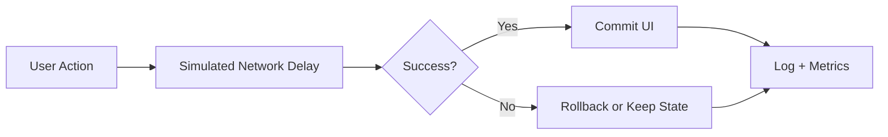

# UX Latency Lab

Interactive lab for testing how latency and feedback patterns influence user perception.

## Experiments Included

1. **Interaction delay threshold**
   - Configure artificial delay.
   - Apply network profile presets.
   - Run repeated trials.
- Benchmark all built-in profiles in one shot.
- View measured timings and average.
- Session percentile cut points for median, P75, P95, and slowest-trial analysis.

2. **Loading feedback perception**
   - Compare spinner vs skeleton loading states.
   - Record perceived speed ratings.
   - Track average scores by loading strategy.

3. **Optimistic UI vs standard updates**
   - Adjustable simulated failure rate.
   - Standard flow waits for server before UI update.
   - Optimistic flow updates immediately and rolls back on failure.
   - Event log records behavior over time.
   - Success/rollback rate summary explains when optimistic UI is still justified.
- Session memo converts the current experiment data into a product-facing recommendation.
- Policy scorecard turns the current session into concrete guidance for action feedback, loader choice, and commit strategy.

## Technical Design

- `index.html`: three experiment modules with semantic sections.
- `styles.css`: dark dashboard UI with responsive layout.
- `script.js`: async simulation engine for timing and request outcomes.



## Local Run

```bash
python -m http.server 8000
```

Open `http://localhost:8000`.

## GitHub Pages Compatibility

- Fully static.
- No backend dependencies.
- Deploy from repository root.

## Future Improvements

- Add charts for percentile latency distributions.
- Add offline-first scenarios and cache-hit simulations.
- Export experiment session data as JSON.
